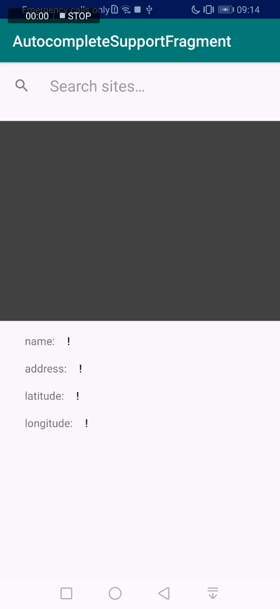
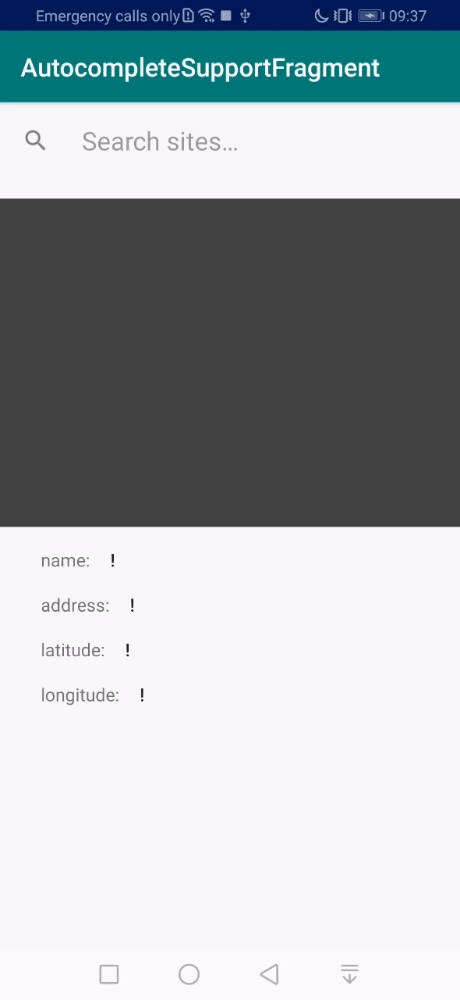

# An AutocompleteSupportFragment for HMS Site kit

This library provides a fragment similar to the Google Places [AutocompleteSupportFragment](https://developers.google.com/places/android-sdk/autocomplete), for the HMS [Site kit](https://developer.huawei.com/consumer/en/hms/huawei-sitekit)
Shows suggestions when searching for places

## Configuration

**WARNING**: Before you can start using the HMS Platform APIs and SDKs, you must register your app in the AppGallery and configure your project, this step cannot be skipped.

See [configuration Instructions](CONFIGURATION.md).

## Installation
add jitpack repo to your project level `build.gradle` file:

``` groovy
        allprojects {
    		repositories {
    			...
    			maven { url 'https://jitpack.io' }
    		}
    	}
```
add the library to your app level 'build.bradle' file:
``` groovy
	dependencies {
	        implementation 'com.github.megaacheyounes:siteautocomoplete:v1.0.1'
	}
```

## Add the fragment

### Method 1 (xml):
add the fragment tag with the name attribute:
``` xml
    <fragment
        android:id="@+id/fragment"
        android:layout_width="match_parent"
        android:layout_height="wrap_content"
        android:name="com.megaache.siteautocomplete.SiteAutocompleteFragment">

    </fragment>
```
Initialize the fragment:
``` kotlin
    val autocompleteFragment = supportFragmentManager.findFragmentById(R.id.fragment) as SiteAutocompleteFragment
```

### Method 2 (kotlin):
declare the fragment container:
``` xml
   <FrameLayout
        android:id="@+id/fragment_container"
        android:layout_width="match_parent"
        android:layout_height="wrap_content">

    </FrameLayout>
```
then add `SiteAutocompleteFragment` fragment dynamically using the `supportFragmentManager`:
``` kotlin
   val autocompleteFragment = SiteAutocompleteFragment.newInstance()

   supportFragmentManager.beginTransaction().replace(R.id.fragment_container, fragment)
            .commit()

   supportFragmentManager.executePendingTransactions()
```

## Display mode


- Fullscreen mode:


```kotlin
            autocompleteFragment.setActivityMode(SiteAutocompleteMode.FULLSCREEN)
```

- Overlay mode:


```kotlin
            autocompleteFragment.setActivityMode(SiteAutocompleteMode.OVERLAY)
```

## Listen for Place selection event

```kotlin
    fragment.setOnSiteSelectListener(
                object : AutocompleteSupportFragment.SiteSelectionListener {
                    override fun onSiteSelected(site: Site) {
                        Log.d("onSiteSelected", site.name)
                    }
                }
            )
```

## Internationalization
The fragment supports 8 languages: English, Arabic, Chinese, French, Hindi, German, Russian, Spanish

## Important

To run the example app you must create an app in huawei console, then add the config file 'agconnect-config.json' into the project and update the package name according to package name in config file


## Contributions

All kinds of contributions are welcome

## HMS
learn more about HMS: [**here**](https://developer.Huawei.com/consumer/en/hms)


```
  Copyright (C) 2020 Younes Megaache

  Licensed under the Apache License, Version 2.0 (the "License");
  you may not use this file except in compliance with the License.
  You may obtain a copy of the License at

      http://www.apache.org/licenses/LICENSE-2.0

  Unless required by applicable law or agreed to in writing, software
  distributed under the License is distributed on an "AS IS" BASIS,
  WITHOUT WARRANTIES OR CONDITIONS OF ANY KIND, either express or implied.
  See the License for the specific language governing permissions and
  limitations under the License.
```


